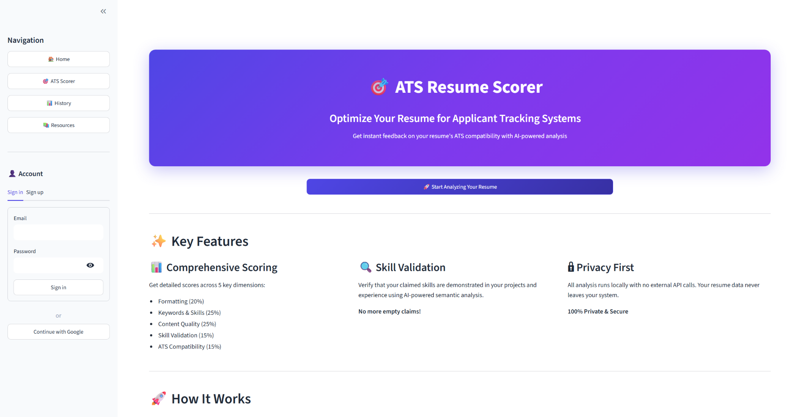
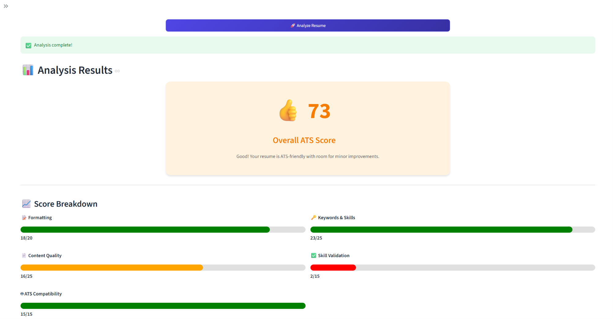
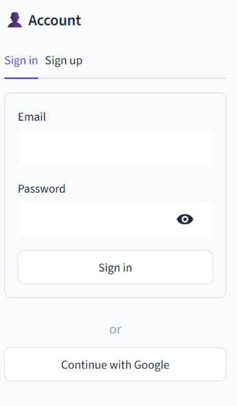
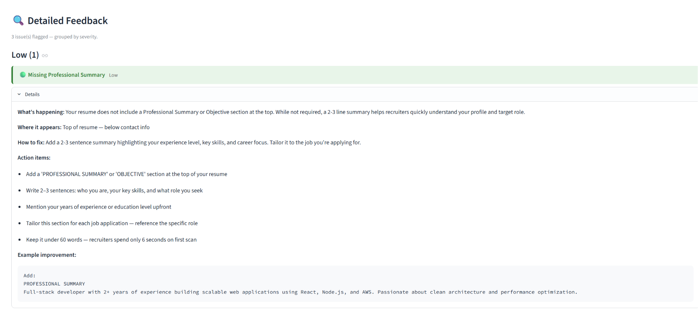
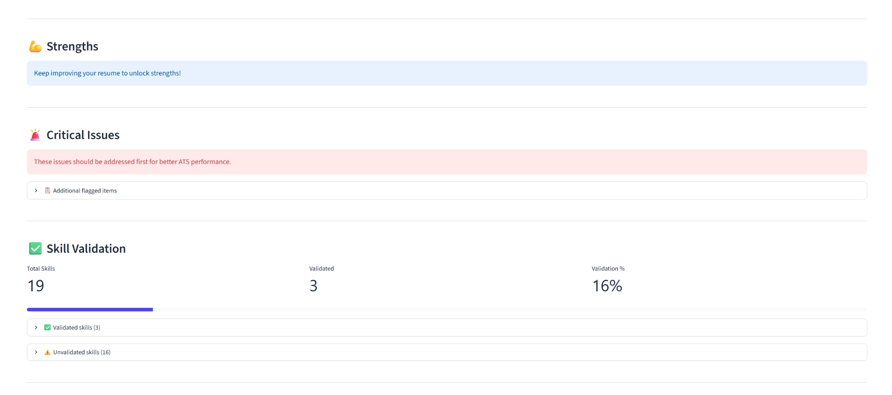

# 🚀 Explainable ATS Resume Analyzer with Job Match

<p align="center">
  
</p>

<p align="center">
  <b>AI-powered Resume Analyzer using BERT, Semantic Matching & Explainable ATS Scoring</b>
</p>

<p align="center">
  
  
  
  
</p>

---

# 🧠 Overview

This project is a **full-stack AI system** that simulates how real-world Applicant Tracking Systems (ATS) evaluate resumes.

Unlike basic resume checkers, this system provides:

✔ Semantic understanding using BERT  
✔ Skill validation (not just keyword matching)  
✔ Explainable feedback  
✔ Structured ATS scoring  

---

# 🧬 AI Pipeline

<p align="center">
  
</p>

```
Resume → Text Extraction → BERT Embeddings → Fine-Tuned Model → 
Skill Extraction → ATS Scoring → Explainable Feedback
```

---

# 📒 Core Machine Learning (IPYNB FOCUS)

## 🔬 1. EDA & Data Preparation
- Resume parsing & cleaning  
- Token analysis  
- Dataset preparation  

## 🧠 2. BERT Embeddings
- Sentence embeddings  
- Semantic similarity  
- Skill matching  

## 🔥 3. BERT Fine-Tuning
- Custom classification  
- Domain-specific learning  
- Improved ATS scoring accuracy  

👉 These notebooks form the **core intelligence of the system**

---

# 🔥 Key Features

## 📊 ATS Scoring Engine
- Formatting (20%)
- Keywords & Skills (25%)
- Content Quality (25%)
- Skill Validation (15%)
- ATS Compatibility (15%)

---

## 🧠 Explainable Feedback
- Detects issues (e.g., missing summary)
- Suggests improvements
- Section-wise insights

---

## 💪 Skill Validation
- Extracted vs actual demonstrated skills  
- Validation percentage  
- Missing skills detection  

---

## 🔐 Authentication
- Email/Password login  
- Google OAuth via Supabase  

---

## ⚡ Interactive UI
- Built with Streamlit  
- Real-time resume analysis  

---

# 📸 Screenshots

## 🔐 Authentication
<p align="center">
  
</p>

---

## 🏠 Dashboard
<p align="center">
  
</p>

---

## 📊 Analysis Result
<p align="center">
  
</p>

---

## 🧠 Detailed Feedback
<p align="center">
  
</p>

---

## 💪 Skills Validation
<p align="center">
  
</p>

---

# 🧭 Application Walkthrough

## 🔐 Authentication
Users can securely log in using:
- Email & Password  
- Google OAuth  

---

## 🏠 Dashboard
- Central navigation hub  
- Upload resume  
- Start analysis instantly  

---

## 📊 Resume Analysis
- Text extraction  
- NLP processing  
- ATS scoring  

---

## 🧠 Feedback System
- Highlights weak sections  
- Gives actionable suggestions  

Example:
> Missing Professional Summary → Add 2–3 line intro  

---

## 💪 Skill Validation
- Detects total skills  
- Validates real usage  
- Shows validation %  

---

## 📈 Score Breakdown
| Component | Purpose |
|----------|--------|
| Formatting | Structure |
| Keywords | Matching |
| Content | Quality |
| Skills | Validation |
| ATS | Optimization |

---

# ⚙️ Tech Stack

| Layer | Tech |
|------|------|
| Frontend | Streamlit |
| Backend | FastAPI |
| NLP | BERT |
| ML | Fine-tuned models |
| Auth | Supabase |
| Tools | libmagic, dotenv |

---

# 📂 Project Structure

```
AI-RESUME-ATS-MAIN/

├── backend/
├── frontend/
├── jupyter_notebooks/
├── Screenshots/
├── requirements.txt
└── README.md
```

---

# ⚙️ Setup Guide

## 1️⃣ Clone Repository

```
git clone https://github.com/Abhay-coding/Explainable-ATS-Resume-Analyzer-with-Job-Match.git
cd Explainable-ATS-Resume-Analyzer-with-Job-Match
```

---

## 2️⃣ Create Environment

```
python -m venv .venv
.venv\Scripts\activate
```

---

## 3️⃣ Install Dependencies

```
pip install -r requirements.txt
```

---

## 4️⃣ Add Environment Variables

Create `.env` file:

```
SUPABASE_URL=your_url
SUPABASE_ANON_KEY=your_key
```

---

## 5️⃣ Run Application

```
cd frontend
streamlit run streamlit_app.py
```

---

# 🎯 Example Output

- 👍 ATS Score: 73  
- ⚠ Missing Summary  
- 💡 Improve keywords  
- 📉 Skill validation: 16%  

---

# 🚀 Future Improvements

- Job Description Matching  
- Resume Auto Rewrite (LLM)  
- Deployment (Cloud)  
- Recruiter Simulation  

---

# 👨‍💻 Author

**Abhay Kumar**  
AI/ML Developer

---

# ⭐ Support

If you like this project:

⭐ Star the repo  
🚀 Share it  
💼 Use it in your portfolio  

---

<p align="center">
  <b>Built to make your resume stand out 🚀</b>
</p>
